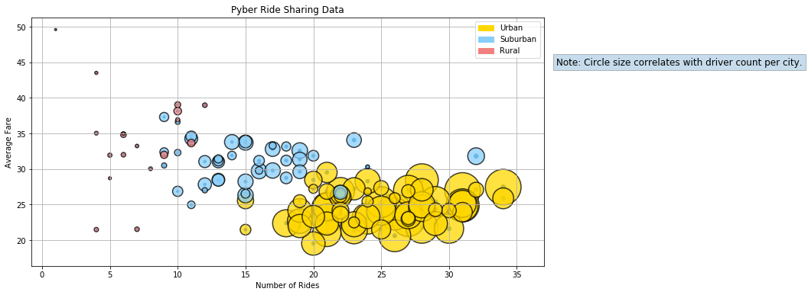
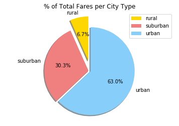
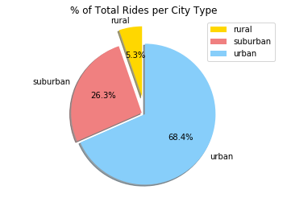
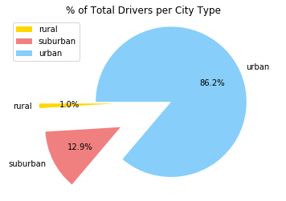

Observable trends based on the data:

- Urban areas have the greatest number of rides per city type and generally a lower fare than other areas with less number of rides.
- It seems that the average fare is higher in cities with less drivers; however, the number of rides also seems to be lower in cities with lower number of drivers.
- The percentage of total rides (68.4%) and total drivers (86.2%) is significantly higher in urban cities than rural or suburban. 
-Although rural areas show the highest average fare per city type, they also show the smallest portion of the total fares by city. This might be related to the fact that rural cities have significantly less drivers and less rides than urban cities.


Challenge:

Your objective is to build a [Bubble Plot](https://en.wikipedia.org/wiki/Bubble_chart) that showcases the relationship 
between four key variables:

* Average Fare ($) Per City
* Total Number of Rides Per City
* Total Number of Drivers Per City
* City Type (Urban, Suburban, Rural)

In addition, you will be expected to produce the following three pie charts:

* % of Total Fares by City Type
* % of Total Rides by City Type
* % of Total Drivers by City Type


```python
# Dependencies
import pandas as pd
import numpy as np
import matplotlib.pyplot as plt
import matplotlib.patches as mpatches
```


```python
# import file using pandas

city_df = pd.read_csv('raw_data/city_data.csv')
ride_df = pd.read_csv('raw_data/ride_data.csv')

print(city_df.head())
print(ride_df.head())

```

                 city  driver_count   type
    0      Kelseyland            63  Urban
    1      Nguyenbury             8  Urban
    2    East Douglas            12  Urban
    3   West Dawnfurt            34  Urban
    4  Rodriguezburgh            52  Urban
              city                 date   fare        ride_id
    0     Sarabury  2016-01-16 13:49:27  38.35  5403689035038
    1    South Roy  2016-01-02 18:42:34  17.49  4036272335942
    2  Wiseborough  2016-01-21 17:35:29  44.18  3645042422587
    3  Spencertown  2016-07-31 14:53:22   6.87  2242596575892
    4   Nguyenbury  2016-07-09 04:42:44   6.28  1543057793673
    


```python
city_df = city_df.drop_duplicates('city', keep = 'first')
#city_unique_df = city_df["city"].nunique()
#.nunique

merged_cities = city_df.merge(ride_df, on = 'city')
merged_cities.head

```


    <bound method NDFrame.head of                 city  driver_count   type                 date   fare  \
    0         Kelseyland            63  Urban  2016-08-19 04:27:52   5.51   
    1         Kelseyland            63  Urban  2016-04-17 06:59:50   5.54   
    2         Kelseyland            63  Urban  2016-05-04 15:06:07  30.54   
    3         Kelseyland            63  Urban  2016-01-25 20:44:56  12.08   
    4         Kelseyland            63  Urban  2016-08-09 18:19:47  17.91   
    5         Kelseyland            63  Urban  2016-10-24 15:15:46  33.56   
    6         Kelseyland            63  Urban  2016-06-06 13:54:23  20.81   
    7         Kelseyland            63  Urban  2016-08-10 07:02:40  44.53   
    8         Kelseyland            63  Urban  2016-07-05 17:37:13  29.02   
    9         Kelseyland            63  Urban  2016-04-25 02:18:31  20.05   
    10        Kelseyland            63  Urban  2016-01-25 08:47:09   9.29   
    11        Kelseyland            63  Urban  2016-11-10 01:57:14  20.58   
    12        Kelseyland            63  Urban  2016-08-15 11:55:02  27.45   
    13        Kelseyland            63  Urban  2016-08-01 10:51:49  33.51   
    14        Kelseyland            63  Urban  2016-04-13 12:07:08   6.56   
    15        Kelseyland            63  Urban  2016-01-12 22:51:21  20.19   
    16        Kelseyland            63  Urban  2016-05-31 01:05:31  35.22   
    17        Kelseyland            63  Urban  2016-07-13 16:53:07  10.31   
    18        Kelseyland            63  Urban  2016-01-07 07:15:41  11.45   
    19        Kelseyland            63  Urban  2016-04-09 13:17:27  27.85   
    20        Kelseyland            63  Urban  2016-06-30 01:59:04   8.27   
    21        Kelseyland            63  Urban  2016-04-20 05:36:59  31.67   
    22        Kelseyland            63  Urban  2016-05-02 05:55:28  40.92   
    23        Kelseyland            63  Urban  2016-06-22 06:54:57  12.58   
    24        Kelseyland            63  Urban  2016-06-18 06:03:03  16.77   
    25        Kelseyland            63  Urban  2016-01-09 20:28:56  27.21   
    26        Kelseyland            63  Urban  2016-07-22 19:28:21  35.71   
    27        Kelseyland            63  Urban  2016-11-26 02:34:57  15.49   
    28        Nguyenbury             8  Urban  2016-07-09 04:42:44   6.28   
    29        Nguyenbury             8  Urban  2016-11-08 19:22:04  19.49   
    ...              ...           ...    ...                  ...    ...   
    2345     East Leslie             9  Rural  2016-04-13 04:30:56  40.47   
    2346     East Leslie             9  Rural  2016-04-26 02:34:30  45.80   
    2347     East Leslie             9  Rural  2016-04-05 18:53:16  44.78   
    2348     East Leslie             9  Rural  2016-11-13 10:21:10  15.71   
    2349     East Leslie             9  Rural  2016-03-06 06:10:40  51.32   
    2350     East Leslie             9  Rural  2016-03-04 10:18:03  13.43   
    2351     East Leslie             9  Rural  2016-11-28 09:09:15  37.76   
    2352     East Leslie             9  Rural  2016-09-08 19:19:38  30.59   
    2353     East Leslie             9  Rural  2016-03-02 22:09:34  36.61   
    2354     East Leslie             9  Rural  2016-06-22 07:45:30  34.54   
    2355  Hernandezshire            10  Rural  2016-02-20 08:17:32  58.95   
    2356  Hernandezshire            10  Rural  2016-06-26 20:11:50  28.78   
    2357  Hernandezshire            10  Rural  2016-01-24 00:21:35  30.32   
    2358  Hernandezshire            10  Rural  2016-03-05 10:40:16  23.35   
    2359  Hernandezshire            10  Rural  2016-04-11 04:44:50  10.41   
    2360  Hernandezshire            10  Rural  2016-06-26 11:16:28  26.29   
    2361  Hernandezshire            10  Rural  2016-11-25 20:34:14  38.45   
    2362  Hernandezshire            10  Rural  2016-11-20 17:32:37  26.79   
    2363  Hernandezshire            10  Rural  2016-02-24 17:30:44  44.68   
    2364       Horneland             8  Rural  2016-07-19 10:07:33  12.63   
    2365       Horneland             8  Rural  2016-03-22 21:22:20  31.53   
    2366       Horneland             8  Rural  2016-01-26 09:38:17  21.73   
    2367       Horneland             8  Rural  2016-03-25 02:05:42  20.04   
    2368  West Kevintown             5  Rural  2016-11-27 20:12:58  12.92   
    2369  West Kevintown             5  Rural  2016-02-19 01:42:58  11.15   
    2370  West Kevintown             5  Rural  2016-03-11 09:03:43  42.13   
    2371  West Kevintown             5  Rural  2016-06-25 08:04:12  24.53   
    2372  West Kevintown             5  Rural  2016-07-24 13:41:23  11.78   
    2373  West Kevintown             5  Rural  2016-06-15 19:53:16  13.50   
    2374  West Kevintown             5  Rural  2016-02-10 00:50:04  34.69   
    
                ride_id  
    0     6246006544795  
    1     7466473222333  
    2     2140501382736  
    3     1896987891309  
    4     8784212854829  
    5     4797969661996  
    6     9811478565448  
    7     1563171128434  
    8     6897992353955  
    9     1148374505062  
    10     213692794373  
    11    3395682132130  
    12    8456148871668  
    13    6610565660737  
    14    8101498434215  
    15    3054122642867  
    16    5946467060438  
    17    2180910323678  
    18     600800386573  
    19    5748868894243  
    20    4384089549855  
    21    2865704421982  
    22    2769007541388  
    23    6629798205387  
    24    7223504701591  
    25     831362906446  
    26    1234880130185  
    27    5187807155760  
    28    1543057793673  
    29    1702803950740  
    ...             ...  
    2345  7075058703398  
    2346  9402873395510  
    2347  6113138249150  
    2348  7275986542384  
    2349  6841691147797  
    2350  8814831098684  
    2351   804829686137  
    2352  8211833105097  
    2353  5500269118478  
    2354   684950063164  
    2355  3176534714830  
    2356  6382848462030  
    2357  7342649945759  
    2358  7443355895137  
    2359  9823290002445  
    2360   304182959218  
    2361  2898512024847  
    2362  3095402154397  
    2363  6389115653382  
    2364  8214498891817  
    2365  1797785685674  
    2366  5665544449606  
    2367  5729327140644  
    2368  6460741616450  
    2369  8622534016726  
    2370  4568909568268  
    2371  8188407925972  
    2372  2001192693573  
    2373  9577921579881  
    2374  9595491362610  
    
    [2375 rows x 6 columns]>


```python
city_pd = pd.DataFrame(city_df)
city_pd
ride_pd = pd.DataFrame(ride_df)
ride_pd.head()
```


<div>
<style scoped>
    .dataframe tbody tr th:only-of-type {
        vertical-align: middle;
    }

    .dataframe tbody tr th {
        vertical-align: top;
    }

    .dataframe thead th {
        text-align: right;
    }
</style>
<table border="1" class="dataframe">
  <thead>
    <tr style="text-align: right;">
      <th></th>
      <th>city</th>
      <th>date</th>
      <th>fare</th>
      <th>ride_id</th>
    </tr>
  </thead>
  <tbody>
    <tr>
      <th>0</th>
      <td>Sarabury</td>
      <td>2016-01-16 13:49:27</td>
      <td>38.35</td>
      <td>5403689035038</td>
    </tr>
    <tr>
      <th>1</th>
      <td>South Roy</td>
      <td>2016-01-02 18:42:34</td>
      <td>17.49</td>
      <td>4036272335942</td>
    </tr>
    <tr>
      <th>2</th>
      <td>Wiseborough</td>
      <td>2016-01-21 17:35:29</td>
      <td>44.18</td>
      <td>3645042422587</td>
    </tr>
    <tr>
      <th>3</th>
      <td>Spencertown</td>
      <td>2016-07-31 14:53:22</td>
      <td>6.87</td>
      <td>2242596575892</td>
    </tr>
    <tr>
      <th>4</th>
      <td>Nguyenbury</td>
      <td>2016-07-09 04:42:44</td>
      <td>6.28</td>
      <td>1543057793673</td>
    </tr>
  </tbody>
</table>
</div>


```python
merge_table = pd.merge(city_pd, ride_pd, on="city")
print(merge_table.head())

merged_cities_df = pd.DataFrame(merged_cities)
merged_cities_df.head()
```

             city  driver_count   type                 date   fare        ride_id
    0  Kelseyland            63  Urban  2016-08-19 04:27:52   5.51  6246006544795
    1  Kelseyland            63  Urban  2016-04-17 06:59:50   5.54  7466473222333
    2  Kelseyland            63  Urban  2016-05-04 15:06:07  30.54  2140501382736
    3  Kelseyland            63  Urban  2016-01-25 20:44:56  12.08  1896987891309
    4  Kelseyland            63  Urban  2016-08-09 18:19:47  17.91  8784212854829
    


<div>
<style scoped>
    .dataframe tbody tr th:only-of-type {
        vertical-align: middle;
    }

    .dataframe tbody tr th {
        vertical-align: top;
    }

    .dataframe thead th {
        text-align: right;
    }
</style>
<table border="1" class="dataframe">
  <thead>
    <tr style="text-align: right;">
      <th></th>
      <th>city</th>
      <th>driver_count</th>
      <th>type</th>
      <th>date</th>
      <th>fare</th>
      <th>ride_id</th>
    </tr>
  </thead>
  <tbody>
    <tr>
      <th>0</th>
      <td>Kelseyland</td>
      <td>63</td>
      <td>Urban</td>
      <td>2016-08-19 04:27:52</td>
      <td>5.51</td>
      <td>6246006544795</td>
    </tr>
    <tr>
      <th>1</th>
      <td>Kelseyland</td>
      <td>63</td>
      <td>Urban</td>
      <td>2016-04-17 06:59:50</td>
      <td>5.54</td>
      <td>7466473222333</td>
    </tr>
    <tr>
      <th>2</th>
      <td>Kelseyland</td>
      <td>63</td>
      <td>Urban</td>
      <td>2016-05-04 15:06:07</td>
      <td>30.54</td>
      <td>2140501382736</td>
    </tr>
    <tr>
      <th>3</th>
      <td>Kelseyland</td>
      <td>63</td>
      <td>Urban</td>
      <td>2016-01-25 20:44:56</td>
      <td>12.08</td>
      <td>1896987891309</td>
    </tr>
    <tr>
      <th>4</th>
      <td>Kelseyland</td>
      <td>63</td>
      <td>Urban</td>
      <td>2016-08-09 18:19:47</td>
      <td>17.91</td>
      <td>8784212854829</td>
    </tr>
  </tbody>
</table>
</div>


```python
city_type = merge_table.groupby('type')['city'].count()
city_type
                                
```


    type
    Rural        125
    Suburban     625
    Urban       1625
    Name: city, dtype: int64


```python
city_type = city_pd.set_index('city')['type']
city_type.head()

```


    city
    Kelseyland        Urban
    Nguyenbury        Urban
    East Douglas      Urban
    West Dawnfurt     Urban
    Rodriguezburgh    Urban
    Name: type, dtype: object


```python
#Average fare per city
average_fare_city = round(merge_table.groupby("city")["fare"].mean(),2)
average_fare_city

#Total Number of Rides per City
total_rides_per_city = merge_table.groupby("city")["ride_id"].count()
total_rides_per_city.head()

# Total Number of Drivers per City
number_drivers_per_city = merge_table.groupby('city')["driver_count"].sum()
number_drivers_per_city.head()

# City Type
city_type = city_df.set_index('city')['type']

# Create dataframe
city = pd.DataFrame({
    "Number of Rides": total_rides_per_city,
    "Average Fare": average_fare_city,
    "Number of Drivers": number_drivers_per_city,
    "Type of City": city_type
                    }
                   )

city = city.sort_values('Number of Drivers', ascending = False)
city.head()
#type of city ValueError: cannot reindex from a duplicate axis
#from stackoverflow: This error usually rises when you join / assign to a column when the index has duplicate values
#my solution: go back to city_df and drop duplicate city names
```


<div>
<style scoped>
    .dataframe tbody tr th:only-of-type {
        vertical-align: middle;
    }

    .dataframe tbody tr th {
        vertical-align: top;
    }

    .dataframe thead th {
        text-align: right;
    }
</style>
<table border="1" class="dataframe">
  <thead>
    <tr style="text-align: right;">
      <th></th>
      <th>Average Fare</th>
      <th>Number of Drivers</th>
      <th>Number of Rides</th>
      <th>Type of City</th>
    </tr>
  </thead>
  <tbody>
    <tr>
      <th>Swansonbury</th>
      <td>27.46</td>
      <td>2176</td>
      <td>34</td>
      <td>Urban</td>
    </tr>
    <tr>
      <th>Williamshire</th>
      <td>26.99</td>
      <td>2170</td>
      <td>31</td>
      <td>Urban</td>
    </tr>
    <tr>
      <th>West Peter</th>
      <td>24.88</td>
      <td>1891</td>
      <td>31</td>
      <td>Urban</td>
    </tr>
    <tr>
      <th>Lisaville</th>
      <td>28.43</td>
      <td>1848</td>
      <td>28</td>
      <td>Urban</td>
    </tr>
    <tr>
      <th>Torresshire</th>
      <td>24.21</td>
      <td>1820</td>
      <td>26</td>
      <td>Urban</td>
    </tr>
  </tbody>
</table>
</div>


```python
city.plot.scatter(x="Number of Rides", y="Average Fare", s=city['Number of Rides'], grid=True, figsize=(12,6), title="Pyber Ride Sharing Data")


plt.scatter(urban['Number of Rides'], urban['Average Fare'], s = urban['Number of Drivers'], color = 'gold', edgecolor = 'black', label = 'Urban', alpha = .75, linewidth = 1.5)
plt.scatter(suburban['Number of Rides'], suburban['Average Fare'], s = suburban['Number of Drivers'], color = 'lightskyblue', edgecolor = 'black', label = 'Suburban', alpha = .75, linewidth = 1.5)
plt.scatter(rural['Number of Rides'], rural['Average Fare'], s = rural['Number of Drivers'], color = 'lightcoral', edgecolor = 'black', label = 'Rural', alpha = .75, linewidth = 1.5)

gold_patch = mpatches.Patch(color='gold', label='Urban')
lightskyblue_patch = mpatches.Patch(color='lightskyblue', label='Suburban')
lightcoral_patch = mpatches.Patch(color='lightcoral', label = 'Rural')

plt.legend(loc='best', handles=[gold_patch,lightskyblue_patch, lightcoral_patch])


plt.text(47, 45, 'Note: Circle size correlates with driver count per city.', fontsize=12, bbox=dict(alpha=0.25), horizontalalignment='center', verticalalignment='center')
plt.show()


```





Pie Charts: 
* % of Total Fares by City Type
* % of Total Rides by City Type
* % of Total Drivers by City Type


```python
#total fare per city
total_fare_city = merge_table.groupby("type")["fare"].sum()

colors = ["gold", "lightcoral", "lightskyblue"]
explode = (0.25, 0.05, 0)
city_type = ["rural", "suburban", "urban"]

plt.pie(total_fare_city, explode=explode, labels=city_type, autopct = "%1.1f%%", colors=colors, shadow=True, startangle=90)
plt.axis("equal")
plt.legend(loc = "upper right")
plt.title("% of Total Fares per City Type")
plt.show()
```





```python
#total rides per city

total_ride_city = merge_table.groupby("type")["ride_id"].count()

#using same colors, explode, and label than before (already defined)

plt.pie(total_ride_city, explode=explode, labels=city_type, autopct = "%1.1f%%", colors=colors, shadow=True, startangle=90)
plt.axis("equal")
plt.legend(loc = "upper right")
plt.title("% of Total Rides per City Type")
plt.show()
```





```python
total_drivers_city = merge_table.groupby("type")["driver_count"].sum()
total_drivers_city
```


    type
    Rural         727
    Suburban     9634
    Urban       64501
    Name: driver_count, dtype: int64


```python
#total drivers per city

total_drivers_city = merge_table.groupby("type")["driver_count"].sum()

#using same colors and label than before (already defined)

explode = (0.75, 0.75, 0)
plt.pie(total_drivers_city, explode=explode, labels=city_type, autopct = "%1.1f%%", colors=colors, shadow=False, startangle=180)
plt.axis("equal")
plt.legend(loc = "best")
plt.title("% of Total Drivers per City Type")
plt.show()
```




